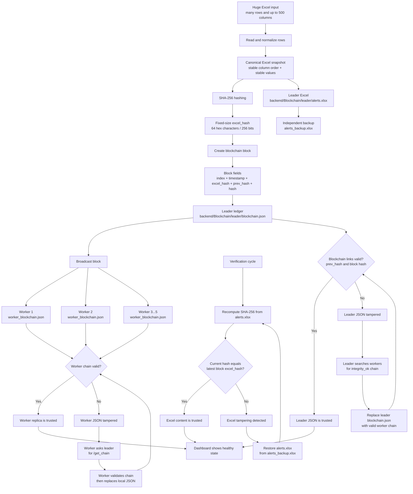
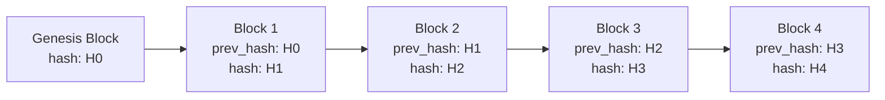
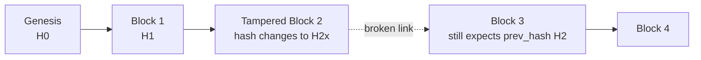
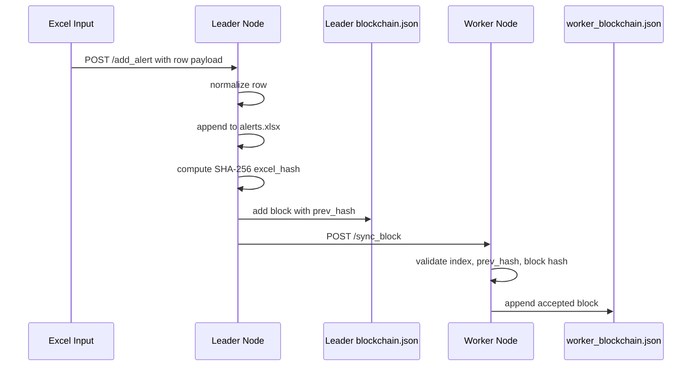
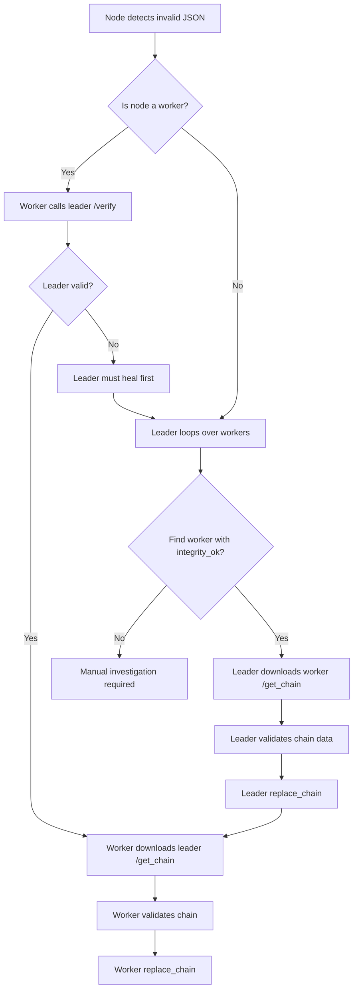
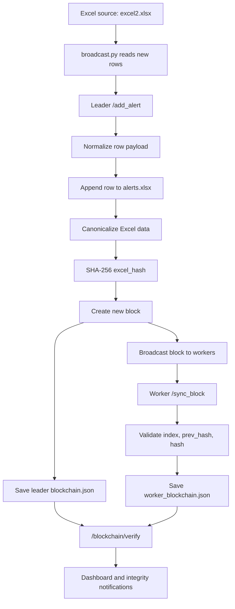

# Research: Cryptographic Blockchain Based Tamper Detection

## Abstract

This project uses cryptography and a lightweight blockchain ledger to detect tampering in alert data much faster than a traditional full-table or full-replica comparison. The core idea is simple: large Excel data is converted into a fixed-size SHA-256 cryptographic value, and that value is stored inside a chain of linked blocks. If the Excel file changes outside the trusted flow, its new cryptographic value will not match the trusted value. If any block in the ledger is modified, the block's own hash or the `prev_hash` link to its neighbor breaks.

In the backend implementation, the leader node protects `alerts.xlsx` by hashing a canonical representation of the Excel data and storing that hash inside `blockchain.json`. Worker nodes store replicated blockchain JSON files and validate each new block before accepting it. This makes tamper detection faster, cheaper, and easier to repair because workers do not need full database replicas of the Excel data.

## Project Mapping

The blockchain system is implemented mainly in these backend files:

| Area | File | Role |
| --- | --- | --- |
| Main backend app | `backend/app.py` | Mounts the blockchain app at `/blockchain`, starts workers, starts the broadcast watcher, starts the integrity checker, and exposes dashboard APIs. |
| Leader blockchain | `backend/Blockchain/leader/blockchain.py` | Converts Excel state to SHA-256 hash, creates blocks, verifies the chain, broadcasts blocks, mitigates Excel tampering, and repairs leader JSON from workers. |
| Worker blockchain | `backend/Blockchain/worker/blockchain.py` | Stores `worker_blockchain.json`, receives blocks from leader, validates block links, and repairs itself from the leader. |
| Excel broadcaster | `backend/Blockchain/leader/broadcast.py` | Watches `excel2.xlsx`, converts rows to alert payloads, and sends them to the leader `/add_alert` endpoint. |
| Protected data | `backend/Blockchain/leader/alerts.xlsx` | Trusted alert spreadsheet protected by the blockchain hash. |
| Recovery backup | `backend/Blockchain/leader/alerts_backup.xlsx` | Independent backup used only for Excel self-healing. |
| Leader ledger | `backend/Blockchain/leader/blockchain.json` | Leader-side blockchain ledger. |
| Worker ledger | `backend/Blockchain/worker/worker_blockchain.json` | Worker-side blockchain replica. |


## Source-Code Evidence

The research claims are grounded in the current backend behavior:

| Claim | Backend evidence |
| --- | --- |
| Excel is converted into a SHA-256 digest | `hash_excel()` in `backend/Blockchain/leader/blockchain.py` reads Excel, sorts columns, converts to CSV, and hashes it. |
| A block stores `excel_hash`, `prev_hash`, and `hash` | `Block` in `backend/Blockchain/leader/blockchain.py` and `backend/Blockchain/worker/blockchain.py`. |
| New blocks are chained to the previous block | `add_block()` sets the new block's `prev_hash` to the previous block's `hash`. |
| Workers reject broken blocks | `add_block_from_leader()` validates block index, previous hash, and block hash before appending. |
| Leader can heal from workers | Leader `/update` loops over worker URLs, verifies a worker, downloads `/get_chain`, validates it, and replaces the local chain. |
| Worker can heal from leader | Worker `/update` verifies the leader, downloads the leader chain, validates it, and replaces its local chain. |
| Excel backup is used for self-healing | Leader `/mitigate` restores `alerts.xlsx` from `alerts_backup.xlsx` when tampering is detected. |

## Problem Statement

Assume an Excel alert dataset has:

```text
n = number of rows
c = number of columns per row
r = number of database replicas
b = number of blockchain blocks
h = SHA-256 digest length = 64 hexadecimal characters = 256 bits
```

In a normal database replica system, each row is independent. If a single column is tampered, the system may need to compare many columns, many rows, and possibly many replicas to discover where the value changed.

For example, if one Excel file has `100,000` rows and `500` columns:

```text
Total cells = n * c
            = 100,000 * 500
            = 50,000,000 cells
```

Without cryptographic compression, worst-case checking can require scanning millions of cells. With five replicas:

```text
Replica comparison work = r * n * c
                        = 5 * 100,000 * 500
                        = 250,000,000 cell comparisons
```

The proposed system avoids this repeated wide comparison by converting the Excel state into a fixed-size hash and then protecting that hash in a blockchain.

## System Overview

  

## Rows to SHA-256, Leader, Workers, Backup, and Recovery WorkFlow




## Excel Data to Cryptographic Value

The leader uses this flow:

1. A row is received from `/add_alert`.
2. Values are normalized so timestamps, numeric types, and missing values are represented consistently.
3. The row is appended into `alerts.xlsx`.
4. The Excel file is loaded into a Pandas DataFrame.
5. Columns are sorted to produce a stable canonical order.
6. The DataFrame is converted to CSV text.
7. SHA-256 converts the CSV text into a 64-character digest.
8. The digest is stored in the newest block as `excel_hash`.

The important function is conceptually:

```python
def hash_excel(path):
    df = pd.read_excel(path)
    df = df.sort_index(axis=1)
    return sha256(df.to_csv(index=False))
```

This means a large Excel state is represented by one fixed-size value:

```text
Excel data with n rows and c columns
        |
        v
Canonical CSV string
        |
        v
SHA-256(...)
        |
        v
64-character digest
```

### Simple Example

Suppose one alert row has five fields:

| ThreatId | Type | Severity | Source | Target |
| --- | --- | --- | --- | --- |
| A-1001 | SQL Injection | critical | 10.0.0.5 | web-01 |

After canonical conversion:

```text
Severity,Source,Target,ThreatId,Type
critical,10.0.0.5,web-01,A-1001,SQL Injection
```

SHA-256 turns that row or workbook snapshot into a fixed-size digest:

```text
SHA256(canonical_text)
= 64b2...a91f
```

If the attacker changes only one value:

```text
critical -> low
```

the digest becomes completely different:

```text
SHA256(tampered_text)
= 18ac...7e40
```

So the detection does not need to manually ask, "Which of the 500 columns changed?" It first asks a much cheaper question:

```text
Does the current cryptographic digest equal the trusted digest?
```

If the answer is no, tampering is detected.

## Block Structure

Each block stores only the metadata needed for integrity:

```json
{
  "index": 12,
  "timestamp": "2026-05-18T10:07:02.430000+00:00",
  "excel_hash": "b4bbf42f9415b32961550ad62f176aca591d4f6e0fba3528da36865c58351462",
  "prev_hash": "820316d810783ee5785033770a404e0342120bff611a1b922b515b83f8191a16",
  "hash": "c9ba30790b607cec744d981e098c7a142d25f8690b721c208832a04a03a0b774"
}
```

The block hash is calculated from:

```text
block_hash_i = SHA256(index_i || timestamp_i || excel_hash_i || prev_hash_i)
```

The chain link is:

```text
prev_hash_i = block_hash_(i - 1)
```

Therefore, every block depends on the previous block. This converts independent rows or snapshots into a linked integrity structure.

## Blockchain Linking Diagram



If an attacker modifies block 2:



The link breaks because:

```text
Block 3 expects: prev_hash_3 = H2
Tampered block gives: hash_2 = H2x
Since H2x != H2, tampering is detected.
```

## Why Cryptography Alone Is Not Sufficient

Cryptography alone can tell whether the current Excel file matches a known digest. But if hashes are stored as independent records, an attacker could try to change both the Excel data and the stored hash for that row or file.

The blockchain prevents this by making each stored hash dependent on its neighbors. To hide one tampered block, the attacker would need to recompute that block and every following block, and then make the leader and workers accept the same forged history. In this project, workers reject blocks when:

```text
new_block.index != last.index + 1
new_block.prev_hash != last.hash
new_block.hash != SHA256(index || timestamp || excel_hash || prev_hash)
```

So cryptography gives data fingerprinting, and blockchain gives neighbor-based continuity.

## Time Complexity Research Logic

### Traditional Checking

If no cryptographic digest exists, checking whether one column was tampered can require scanning rows and columns.

Worst-case full Excel check:

```text
T_old = O(n * c)
```

For distributed replicas:

```text
T_old_distributed = O(r * n * c)
```

With:

```text
n = 100,000 rows
c = 500 columns
r = 5 replicas
```

the work can become:

```text
T_old_distributed = 5 * 100,000 * 500
                  = 250,000,000 cell comparisons
```

### Cryptographic Checking

After a trusted digest is available, comparing integrity values is constant-size:

```text
T_digest_compare = O(1)
```

because SHA-256 always produces a 256-bit value, no matter whether the Excel row has 5 columns or 500 columns.

When the live Excel file must be freshly hashed, the file still has to be read:

```text
T_hash_excel = O(n * c)
```

This is unavoidable because the system must read the data to prove what the current data is. The gain is that the system avoids repeated manual column-by-column and replica-by-replica comparison. It converts a wide comparison problem into:

```text
1. Read and hash current canonical data.
2. Compare one 64-character digest against the trusted digest.
3. Validate fixed-size blockchain links.
```

### Blockchain Chain Validation

For `b` blocks, each block validation performs constant-size checks:

```text
Check 1: curr.prev_hash == prev.hash
Check 2: curr.hash == SHA256(curr.index || curr.timestamp || curr.excel_hash || curr.prev_hash)
```

Therefore:

```text
T_chain = O(b)
```

This is efficient because each block is small JSON metadata, not a full Excel replica. In the current workspace, the leader and worker ledgers each contain `57` blocks, so a full chain check is only 56 neighbor checks after genesis.

### Comparison of Detection Cost

| Scenario | Traditional method | Blockchain/hash method |
| --- | --- | --- |
| Detect whether one 500-column row changed | Up to `O(c)` column checks for that row | `O(1)` digest comparison after hash exists |
| Detect whether an Excel file changed | `O(n * c)` cell scan/comparison | `O(n * c)` to hash once, then `O(1)` digest comparison |
| Validate five distributed replicas | `O(r * n * c)` cell comparisons | `O(r * b)` small block validations |
| Detect ledger tampering | No neighbor relation, rows are independent | `O(b)` hash-link validation |
| Repair a broken node | Search full replicas | Copy a validated chain JSON from leader or worker |

## Numerical Example: 500 Columns

Assume:

```text
n = 100,000 rows
c = 500 columns
r = 5 replicas
b = 100,000 blocks
```

Traditional distributed check:

```text
5 replicas * 100,000 rows * 500 columns
= 250,000,000 cell comparisons
```

Hash-based leader check:

```text
Read current Excel once and compute SHA-256:
100,000 * 500 = 50,000,000 cell reads

Compare digest:
1 fixed-size comparison
```

Worker chain check:

```text
5 ledgers * 100,000 blocks
= 500,000 small JSON block validations
```

The worker check is much smaller than comparing Excel replicas because each block contains only:

```text
index + timestamp + excel_hash + prev_hash + hash
```

not all 500 columns.

### Fraction-of-Time Estimate

Using the same example:

```text
Traditional broad replica check = 250,000,000 cell comparisons
Leader hash check against backup = 2 * 100,000 * 500
                                = 100,000,000 cell reads for hashing
```

So even when the leader hashes both current Excel and backup Excel, the Excel-side read work is:

```text
100,000,000 / 250,000,000 = 0.40
```

That is about `40%` of the broad five-replica comparison work, before adding the benefit that workers validate compact JSON ledgers instead of full Excel replicas.

For worker-side validation:

```text
Traditional replica comparison = 250,000,000 cell comparisons
Blockchain worker validation   = 500,000 block validations
Approximate reduction factor   = 250,000,000 / 500,000
                               = 500x fewer comparison units
```

These units are not identical operations, but the research conclusion is clear: after data is compressed into hashes, distributed integrity checking moves away from wide cell comparison and toward small fixed-size hash validation.

## Storage Complexity

Traditional distributed storage with five full database replicas:

```text
S_old = O(r * n * c * s)
```

where `s` is average storage per cell.

This project stores:

```text
1 leader Excel file
1 independent Excel backup for self-healing
(w + 1) blockchain JSON ledgers
```

So:

```text
S_new = O(2 * n * c * s + (w + 1) * b * block_size)
```

where `w` is worker count and `block_size` is small because a block stores hashes and metadata, not the full row contents.

If workers stored full Excel replicas:

```text
S_replica = O((w + 1) * n * c * s)
```

But in this project, workers store blockchain JSON. That is why the worker side is more storage efficient.

## Leader and Worker Protocol

### Normal Write Path



### Leader Verification

The leader `/verify` endpoint checks:

```text
blockchain_valid = every block hash and prev_hash is correct
file_changed = blockchain JSON differs from the baseline signature loaded by the process
excel_intact = alerts.xlsx hash matches alerts_backup.xlsx hash
excel_matches_chain = current alerts.xlsx hash matches latest block excel_hash
integrity_ok = blockchain_valid and not file_changed and not excel_tampered
```

### Worker Verification

The worker `/verify` endpoint checks:

```text
chain_valid = every block hash and prev_hash is correct
file_changed = worker JSON differs from the baseline signature loaded by the process
integrity_ok = chain_valid and not file_changed
```

Workers do not need to store the full Excel file. They only need to know that the chain of trusted Excel hashes is intact.

## Circular Self-Healing Protocol

The healing logic follows the conclusion from the research findings:

1. If a worker is broken, the worker first asks the leader for a valid chain.
2. If the leader is valid, the worker replaces its local JSON with the leader chain.
3. If the leader is also broken, the leader searches workers in order.
4. The first worker with `integrity_ok = true` becomes the repair source.
5. The leader validates that worker's chain data before replacing its own chain.
6. After the leader heals itself, the broken worker can heal from the leader.



This makes the system circular and resilient:

```text
worker broken -> use leader
leader broken -> use valid worker
leader healed -> worker can heal from leader
```

## Excel Self-Healing

The blockchain JSON protects the history of Excel hashes. The Excel backup protects the current spreadsheet content.

When `alerts.xlsx` is tampered:

```text
hash(alerts.xlsx) != hash(alerts_backup.xlsx)
```

The `/mitigate` endpoint restores:

```text
alerts_backup.xlsx -> alerts.xlsx
```

This is cheaper than keeping many full database replicas. The backup is independent and required only for self-healing. Workers still only need blockchain JSON, not full Excel copies.

## Research Findings Converted to System Claims

1. A row with many columns can be represented by one cryptographic digest. In this backend, the protected Excel snapshot is represented by a single SHA-256 `excel_hash` per block. This avoids repeated 500-column comparisons during integrity checks.
2. Cryptography alone is not enough because independent hashes can also be edited. The blockchain adds `prev_hash` links, so changing a block breaks its relationship with neighboring blocks.
3. Before blockchain, database rows are independent. After blockchain, every committed Excel state is part of a linked historical sequence.
4. In distributed systems, comparing full replicas is expensive. Comparing blockchain JSON and fixed-size hashes is faster and lighter.
5. Storing five full database replicas is expensive. Storing one leader Excel, one backup Excel, and worker blockchain JSON is more storage efficient.
6. Self-healing no longer requires many full replicas. A single clean backup can restore Excel content, and a valid chain from one clean node can restore blockchain JSON.
7. Alerts backup is independent and only used when Excel content must be restored.
8. The leader-worker protocol supports circular recovery: workers heal from leader, and leader heals from any valid worker when its own JSON is broken.

## Summary



## Security Reasoning

SHA-256 has the avalanche effect: a one-character change in the input produces a completely different digest. This is why a tampered cell, row, or file becomes visible through a digest mismatch.

SHA-256 is also preimage resistant for practical purposes. Given a trusted digest, an attacker cannot realistically construct a different Excel dataset with the same digest.

The chain adds tamper evidence. If an attacker changes:

```text
excel_hash_i
```

then:

```text
hash_i = SHA256(index_i || timestamp_i || excel_hash_i || prev_hash_i)
```

must also change. But then:

```text
prev_hash_(i + 1)
```

no longer points to the new `hash_i`. This breaks the chain.

To hide the tampering, the attacker would need to rewrite block `i`, block `i + 1`, and every block after that, then also make the leader and all worker ledgers accept the rewritten version. The worker validation and update protocol make this much harder than changing one Excel cell.

## Important Implementation Note

The current backend hashes the canonical Excel snapshot, not a separately stored per-row hash table. Therefore:

```text
Current implementation:
Excel snapshot -> one SHA-256 excel_hash -> one block
```

This still gives strong tamper detection and removes the need for repeated cell-by-cell replica comparison. However, the Excel file must still be read when generating or recomputing the snapshot hash.

A future optimization could store:

```text
row_i_hash = SHA256(canonical_row_i)
merkle_root = hash tree over all row hashes
```

Then single-row verification could become:

```text
O(c) to hash the row
O(log n) to verify the Merkle proof
O(1) to compare the root stored in the block
```

That would make row-local tamper detection even faster while keeping the same blockchain architecture.

## Conclusion

The project reduces tamper detection time by replacing broad data comparison with cryptographic comparison and blockchain continuity checks. A 500-column Excel row or a large Excel snapshot is reduced to a fixed-size SHA-256 value. That value is then stored inside a block whose hash depends on the previous block. Because each block is linked to its neighbor, tampering is no longer a hidden local edit. It becomes a broken chain relationship.

In a distributed setup, workers do not need full Excel replicas. They only need the blockchain JSON ledger, which is smaller and faster to validate. If a worker is corrupted, it can heal from the leader. If the leader is corrupted, it can search workers for a valid chain, replace its own broken JSON, and then help corrupted workers recover. The result is a faster, cheaper, and more resilient tamper detection system for Excel-based alert data.
